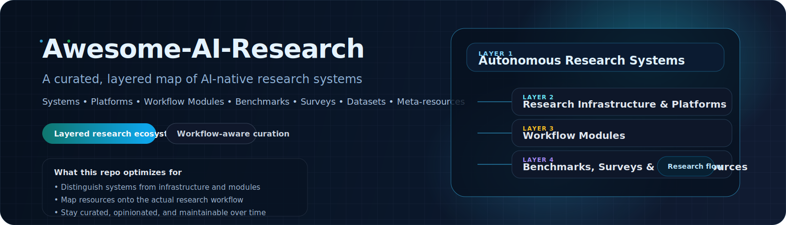
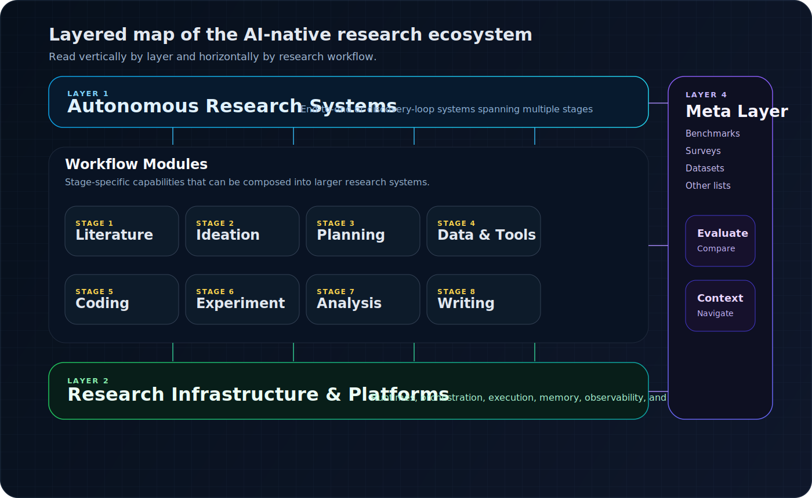

<!--lint disable awesome-heading awesome-github awesome-license awesome-toc double-link-->

# Awesome-AI-Research [](https://awesome.re)

<div align="center">
  <p>
    <a href="https://research-equality.github.io/Awesome-AI-Research/">
      
    </a>
    
    
    
  </p>
  <p><strong>A curated, layered map of AI-native research systems.</strong></p>
  <p>Spanning autonomous research systems, research infrastructures, workflow modules, and meta-resources.</p>
  
</div>

This repository is not a generic paper dump, a flat tool directory, or an AI Scientist-only roundup. It is an opinionated map of the **AI for Research** ecosystem, organized through two complementary lenses:

<!--lint disable awesome-list-item-->
- **System level**: system, platform, module, benchmark, survey, dataset, and meta-resource.
- **Research workflow**: literature, ideation, planning, data/tool use, coding, experiment, analysis, and writing.
<!--lint enable awesome-list-item-->

The goal is simple: make the landscape easier to understand, easier to compare, and easier to extend over time.

> An interactive showcase site lives in [website/](website) and is ready for GitHub Pages deployment through [`.github/workflows/deploy-website.yml`](.github/workflows/deploy-website.yml).

## Why this repo is different

<!--lint disable awesome-list-item-->
- **Not just papers**: papers appear when they are the canonical reference point for a meaningful research system, benchmark, or survey.
- **Not just tools**: every item is placed by what it actually is in the stack, not by vague “AI research assistant” marketing language.
- **Not just AI Scientist projects**: the map includes the enabling platforms, workflow modules, and meta-resources that make the ecosystem legible.
- **Not just one taxonomy**: each entry is curated through both a layer view and a workflow-stage view.
<!--lint enable awesome-list-item-->

This makes the repo more useful for researchers, lab leads, platform builders, and anyone trying to reason about where a project fits in the broader research stack.

## Visual structure

<div align="center">
  
</div>

Systems span the full loop, platforms provide the runtime and coordination substrate, modules sit on specific workflow stages, and benchmarks/surveys/datasets help the whole space stay inspectable.

## Featured Resources

| Resource | Why it matters | Primary layer |
| --- | --- | --- |
| [**The AI Scientist**](https://github.com/SakanaAI/AI-Scientist) | A canonical public reference for end-to-end automated research loops. | `System` |
| [**AI co-scientist**](https://research.google/blog/accelerating-scientific-breakthroughs-with-an-ai-co-scientist) | A strong example of multi-agent hypothesis generation with explicit scientist oversight. | `System` |
| [**Coscientist**](https://www.nature.com/articles/s41586-023-06792-0) | One of the clearest demonstrations of LLM-driven experimental orchestration in science. | `System` |
| [**FutureHouse**](https://www.futurehouse.org/) | A research-native platform narrative centered on automating scientific discovery. | `Platform` |
| [**PaperQA2**](https://github.com/Future-House/paper-qa) | A practical, open-source module for citation-grounded literature synthesis. | `Module` |
| [**STORM**](https://github.com/stanford-oval/storm) | A strong open-source reference for grounded, citation-backed research writing workflows. | `Module` |
| [**PaperBench**](https://openai.com/index/paperbench/) | A benchmark that treats research replication itself as the evaluation target. | `Benchmark` |
| [**AI4Research**](https://ai-4-research.github.io/) | A living survey site that complements this repo with broad paper coverage. | `Survey` |

## Table of Contents

<!--lint disable awesome-list-item-->
- [Website & Publishing](#website--publishing)
- [🧠 Autonomous Research Systems](#-autonomous-research-systems)
- [🏗 Research Infrastructure & Platforms](#-research-infrastructure--platforms)
- [🔬 Workflow Modules](#-workflow-modules)
- [📚 Benchmarks, Surveys & Meta-Resources](#-benchmarks-surveys--meta-resources)
- [Tag System](#tag-system)
- [Inclusion Criteria](#inclusion-criteria)
- [Contributing](#contributing)
- [Changelog](#changelog)
- [License](#license)
- [Acknowledgements / Inspirations](#acknowledgements--inspirations)
<!--lint enable awesome-list-item-->

> Each entry uses the repository's compact tag ribbon: `Level` · `Stage` · `Loop` · `Domain` · `Openness`.
> The full curation model, including `Scope` and `Maturity`, lives in [docs/tag-system.md](docs/tag-system.md).

## Website & Publishing

The repository includes a dedicated showcase website and a lightweight publishing workflow.

<!--lint disable awesome-list-item-->
- Live site: [GitHub Pages site](https://research-equality.github.io/Awesome-AI-Research/)
- Frontend source: [website/](website)
- GitHub Pages deployment: [`.github/workflows/deploy-website.yml`](.github/workflows/deploy-website.yml)
- Publishing guide: [docs/publishing.md](docs/publishing.md)
- Social preview assets: [PNG](assets/social-preview.png) / [SVG](assets/social-preview.svg)
<!--lint enable awesome-list-item-->

## 🧠 Autonomous Research Systems

Systems in this layer attempt to cover a substantial portion of the research loop: idea generation, literature grounding, experiment planning, execution, iteration, analysis, or writing.

<!--lint disable awesome-list-item-->

### End-to-End AI Scientist Systems

- [AI co-scientist](https://research.google/blog/accelerating-scientific-breakthroughs-with-an-ai-co-scientist) - Multi-agent scientific collaborator from Google Research that proposes, debates, ranks, and refines hypotheses with scientist oversight.
  `Level: System` · `Stage: End-to-end` · `Loop: Human-in-the-loop` · `Domain: General` · `Openness: Paper-only`
- [The AI Scientist](https://github.com/SakanaAI/AI-Scientist) - Open-source end-to-end system that turns a seed codebase into ideas, experiments, figures, reviews, and a draft paper.
  `Level: System` · `Stage: End-to-end` · `Loop: Closed-loop` · `Domain: General` · `Openness: Open-source`

### Closed-Loop Discovery Systems

- [Coscientist](https://www.nature.com/articles/s41586-023-06792-0) - Chemistry agent that plans syntheses, searches documentation, controls instruments, and iterates through experimental workflows.
  `Level: System` · `Stage: End-to-end` · `Loop: Closed-loop` · `Domain: Chemistry` · `Openness: Paper-only`
- [PiFlow](https://github.com/amair-lab/PiFlow) - Principle-aware multi-agent framework for iterative scientific discovery across nanomaterials, biomolecules, and superconductors.
  `Level: System` · `Stage: Experiment` · `Loop: Closed-loop` · `Domain: Multi-domain` · `Openness: Open-source`

### Self-Improving / Self-Evolving Research Systems

- [The AI Scientist-v2](https://github.com/SakanaAI/AI-Scientist-v2) - Agentic-tree-search successor designed for workshop-level automated scientific discovery and higher-quality research trajectories.
  `Level: System` · `Stage: End-to-end` · `Loop: Closed-loop` · `Domain: General` · `Openness: Open-source`

### Domain-Specific Autonomous Discovery Systems

- [ChemCrow](https://github.com/ur-whitelab/chemcrow-public) - Tool-augmented chemistry agent that combines LLM reasoning with scientific software for synthesis and discovery tasks.
  `Level: System` · `Stage: Planning` · `Loop: Human-in-the-loop` · `Domain: Chemistry` · `Openness: Open-source`

## 🏗 Research Infrastructure & Platforms

This layer covers the substrate that makes AI-native research systems practical: runtimes, orchestration, execution sandboxes, observability, and collaboration layers.

### Research Platforms

- [FutureHouse](https://www.futurehouse.org/) - Nonprofit research platform building AI agents to automate scientific discovery in biology and other complex sciences.
  `Level: Platform` · `Stage: End-to-end` · `Loop: Human-in-the-loop` · `Domain: Multi-domain` · `Openness: Closed-source`

### Agent Runtimes for Research

- [AutoGen](https://github.com/microsoft/autogen) - Multi-agent programming framework widely used to build research copilots, literature agents, and evaluation pipelines.
  `Level: Platform` · `Stage: End-to-end` · `Loop: Human-in-the-loop` · `Domain: General` · `Openness: Open-source`
- [LangGraph](https://docs.langchain.com/oss/python/langgraph) - Stateful graph runtime for long-running agent workflows that need branching, memory, recovery, and explicit control flow.
  `Level: Platform` · `Stage: End-to-end` · `Loop: Human-in-the-loop` · `Domain: General` · `Openness: Open-source`
- [OpenHands](https://github.com/All-Hands-AI/OpenHands) - Agent runtime for repo-level coding, execution, and issue-driven engineering that can be adapted to research coding workflows.
  `Level: Platform` · `Stage: Coding` · `Loop: Human-in-the-loop` · `Domain: CS` · `Openness: Partially Open`

### Research Workflow Orchestration

- [AgentScope](https://github.com/agentscope-ai/agentscope) - Agent-oriented programming framework for composing multi-agent workflows with explicit roles, collaboration patterns, and tool integration.
  `Level: Platform` · `Stage: End-to-end` · `Loop: Human-in-the-loop` · `Domain: General` · `Openness: Open-source`

### Tool-Use & Execution Infrastructure

- [E2B](https://e2b.dev/) - Sandboxed execution layer for code, browser, and desktop-style tool use inside AI-driven research workflows.
  `Level: Platform` · `Stage: Data` · `Loop: Human-in-the-loop` · `Domain: General` · `Openness: Partially Open`

### Memory / Observability / Collaboration Layers

- [Weights & Biases](https://wandb.ai/) - Experiment tracking and collaboration layer for instrumenting long-running research agents, ablations, and benchmark runs.
  `Level: Platform` · `Stage: Analysis` · `Loop: Human-in-the-loop` · `Domain: General` · `Openness: Partially Open`

## 🔬 Workflow Modules

This layer isolates reusable units in the research workflow. Some items here are full products or platforms, but they are included because their most useful contribution is a specific research-stage capability.

### 3.1 Literature Discovery & Review

- [Elicit](https://elicit.com/) - AI research assistant for literature search, evidence extraction, and structured review workflows.
  `Level: Module` · `Stage: Literature` · `Loop: Human-in-the-loop` · `Domain: General` · `Openness: Closed-source`
- [PaperQA2](https://github.com/Future-House/paper-qa) - Open-source literature QA and evidence-synthesis stack optimized for scientific documents and citation-grounded answers.
  `Level: Module` · `Stage: Literature` · `Loop: Human-in-the-loop` · `Domain: General` · `Openness: Open-source`
- [ResearchRabbit](https://www.researchrabbit.ai/) - Visual citation-graph exploration tool for expanding seed papers into neighborhoods of related work.
  `Level: Module` · `Stage: Literature` · `Loop: Human-in-the-loop` · `Domain: General` · `Openness: Closed-source`

### 3.2 Research Ideation & Hypothesis Generation

- [AI co-scientist](https://research.google/blog/accelerating-scientific-breakthroughs-with-an-ai-co-scientist) - Makes hypothesis generation explicit through proposal, debate, ranking, and refinement rather than hiding ideation inside a generic “deep research” interface.
  `Level: Module` · `Stage: Ideation` · `Loop: Human-in-the-loop` · `Domain: General` · `Openness: Paper-only`
- [Consensus](https://consensus.app/) - Scientific search engine geared toward claim-grounded answers, useful for scoping evidence and framing candidate hypotheses.
  `Level: Module` · `Stage: Ideation` · `Loop: Human-in-the-loop` · `Domain: General` · `Openness: Closed-source`

### 3.3 Planning & Experimental Design

- [ChemCrow](https://github.com/ur-whitelab/chemcrow-public) - Uses chemistry tools and search to translate high-level questions into actionable experimental reasoning and design steps.
  `Level: Module` · `Stage: Planning` · `Loop: Human-in-the-loop` · `Domain: Chemistry` · `Openness: Open-source`
- [Coscientist](https://www.nature.com/articles/s41586-023-06792-0) - Demonstrates protocol planning, synthesis search, and step-by-step lab orchestration in a chemistry setting.
  `Level: Module` · `Stage: Planning` · `Loop: Closed-loop` · `Domain: Chemistry` · `Openness: Paper-only`

### 3.4 Data, Environment & Tool Use

- [E2B](https://e2b.dev/) - Provides the execution substrate needed for safe code runs, browser control, and reproducible tool use by research agents.
  `Level: Module` · `Stage: Data` · `Loop: Human-in-the-loop` · `Domain: General` · `Openness: Partially Open`
- [GeneAgent](https://github.com/ncbi-nlp/GeneAgent) - Domain-database agent for gene set analysis that shows how scientific tool use can be grounded in external biomedical resources.
  `Level: Module` · `Stage: Data` · `Loop: Human-in-the-loop` · `Domain: Biology` · `Openness: Open-source`

### 3.5 Method Development & Research Coding

- [AutoGen](https://github.com/microsoft/autogen) - A flexible substrate for building custom research coding agents with explicit roles, tools, and review loops.
  `Level: Module` · `Stage: Coding` · `Loop: Human-in-the-loop` · `Domain: General` · `Openness: Open-source`
- [OpenHands](https://github.com/All-Hands-AI/OpenHands) - Repo-level coding agent for implementing research ideas, modifying codebases, and validating changes through execution.
  `Level: Module` · `Stage: Coding` · `Loop: Human-in-the-loop` · `Domain: CS` · `Openness: Partially Open`

### 3.6 Experiment Execution & Optimization

- [Optuna](https://optuna.org/) - Open-source optimization framework for trial scheduling, hyperparameter search, and controlled experiment iteration.
  `Level: Module` · `Stage: Experiment` · `Loop: Open-loop` · `Domain: General` · `Openness: Open-source`
- [PiFlow](https://github.com/amair-lab/PiFlow) - Useful reference for budgeted iterative hypothesis testing where experiment execution is embedded inside a discovery loop.
  `Level: Module` · `Stage: Experiment` · `Loop: Closed-loop` · `Domain: Multi-domain` · `Openness: Open-source`

### 3.7 Analysis, Evaluation & Interpretation

- [PaperBench](https://openai.com/index/paperbench/) - Benchmarks whether agents can reproduce state-of-the-art AI research workflows from scratch, which makes it useful as an evaluation module as well as a benchmark suite.
  `Level: Benchmark` · `Stage: Analysis` · `Loop: Open-loop` · `Domain: CS` · `Openness: Partially Open`
- [Weights & Biases](https://wandb.ai/) - Shared workspace for tracking metrics, visualizing runs, comparing ablations, and reviewing long research trajectories.
  `Level: Module` · `Stage: Analysis` · `Loop: Human-in-the-loop` · `Domain: General` · `Openness: Partially Open`

### 3.8 Writing, Publication & Communication

- [Overleaf AI](https://www.overleaf.com/about/ai-features) - AI-assisted writing and editing features inside a collaborative LaTeX environment used heavily in academic publication workflows.
  `Level: Module` · `Stage: Writing` · `Loop: Human-in-the-loop` · `Domain: General` · `Openness: Closed-source`
- [STORM](https://github.com/stanford-oval/storm) - Open-source system for grounded long-form report generation with citation-backed outlining and drafting.
  `Level: Module` · `Stage: Writing` · `Loop: Human-in-the-loop` · `Domain: General` · `Openness: Open-source`

## 📚 Benchmarks, Surveys & Meta-Resources

This layer provides context rather than primary workflow execution: evaluation suites, surveys, datasets, and other curated entry points.

### Surveys & Taxonomies

- [A Survey of AI Scientists](https://arxiv.org/abs/2510.23045) - Survey focused on automatic scientists and end-to-end AI research pipelines.
  `Level: Survey` · `Stage: End-to-end` · `Loop: Human-in-the-loop` · `Domain: General` · `Openness: Paper-only`
- [AI4Research](https://ai-4-research.github.io/) - Living survey site mapping AI for scientific research across domains, tasks, and papers.
  `Level: Survey` · `Stage: End-to-end` · `Loop: Human-in-the-loop` · `Domain: Multi-domain` · `Openness: Partially Open`

### Benchmarks & Evaluation Suites

- [Frontiers in Science](https://openai.com/index/frontierscience/) - Benchmark suite for evaluating scientific reasoning across olympiad-style and research-style tasks.
  `Level: Benchmark` · `Stage: Analysis` · `Loop: Open-loop` · `Domain: Multi-domain` · `Openness: Partially Open`
- [PaperBench](https://openai.com/index/paperbench/) - Evaluates whether agents can replicate frontier AI research papers end-to-end, from understanding claims to executing experiments.
  `Level: Benchmark` · `Stage: End-to-end` · `Loop: Open-loop` · `Domain: CS` · `Openness: Partially Open`
- [ScienceBench](https://sciencebench.com/) - Autonomous laboratory benchmark for end-to-end scientific operation and discovery with minimal human oversight.
  `Level: Benchmark` · `Stage: End-to-end` · `Loop: Closed-loop` · `Domain: Multi-domain` · `Openness: Partially Open`

### Datasets

- [OpenAlex](https://openalex.org/) - Open index of works, authors, venues, institutions, and concepts that underpins many research-native retrieval systems.
  `Level: Dataset` · `Stage: Literature` · `Loop: Human-in-the-loop` · `Domain: Multi-domain` · `Openness: Partially Open`
- [Semantic Scholar Academic Graph API](https://www.semanticscholar.org/product/api) - Structured paper metadata and graph endpoints for retrieval, paper linking, and citation analysis.
  `Level: Dataset` · `Stage: Literature` · `Loop: Human-in-the-loop` · `Domain: Multi-domain` · `Openness: Partially Open`

### Other Awesome Lists

- [awesome-research](https://github.com/emptymalei/awesome-research) - Curated collection organized around research workflow tasks, useful as a complementary module-first view.
  `Level: Meta` · `Stage: End-to-end` · `Loop: Human-in-the-loop` · `Domain: General` · `Openness: Open-source`
- [Awesome-AI-Scientists](https://github.com/tsinghua-fib-lab/Awesome-AI-Scientists) - Curated list centered on AI Scientist systems, complementary to this repo's broader layered-map perspective.
  `Level: Meta` · `Stage: End-to-end` · `Loop: Human-in-the-loop` · `Domain: General` · `Openness: Open-source`

### Blogs / Talks / Reading Lists

- [The AI Scientist project page](https://sakana.ai/ai-scientist/) - Canonical project page that explains how Sakana AI decomposes the research loop into agentic stages.
  `Level: Meta` · `Stage: End-to-end` · `Loop: Human-in-the-loop` · `Domain: General` · `Openness: Paper-only`

<!--lint enable awesome-list-item-->

## Tag System

Every entry carries a compact, consistent tag ribbon:

```text
Level: System · Stage: End-to-end · Loop: Closed-loop · Domain: General · Openness: Open-source
```

What the tags mean:

<!--lint disable awesome-list-item-->
- **Level**: what kind of object this is in the ecosystem.
- **Stage**: where it primarily plugs into the research workflow.
- **Loop**: whether it behaves as open-loop, human-in-the-loop, or closed-loop.
- **Domain**: whether it is general or aimed at a specific scientific area.
- **Openness**: how inspectable and reusable the resource is.
<!--lint enable awesome-list-item-->

The extended curation model also tracks `Scope` and `Maturity`. See [docs/tag-system.md](docs/tag-system.md) for the full taxonomy and tagging rules.

## Inclusion Criteria

This repo prioritizes resources that are directly useful for understanding or building **AI-native research systems**.

<!--lint disable awesome-list-item-->
- Prioritize systems, platforms, and modules explicitly tied to research activity.
- Prefer official project pages, repositories, product pages, or paper pages.
- Require a clear functional role, one-sentence description, and unambiguous category placement.
- Avoid dead links, duplicates, vague marketing pages, and general-purpose AI products with no research-specific role.
<!--lint enable awesome-list-item-->

See [docs/inclusion-criteria.md](docs/inclusion-criteria.md) for the full inclusion policy and [docs/curation-principles.md](docs/curation-principles.md) for the curation stance behind it.

## Contributing

Contributions are welcome, especially when they improve the map rather than just making it longer.

<!--lint disable awesome-list-item-->
- Read [CONTRIBUTING.md](CONTRIBUTING.md) before opening a pull request.
- Use the issue and PR templates so new entries arrive with clear metadata.
- Add one-sentence descriptions and tags for every entry.
- Prefer canonical links and avoid placing the same project in multiple sections unless the duplicate view is genuinely useful.
<!--lint enable awesome-list-item-->

If you want to suggest a new resource first, open the **Add Resource** issue template.

## Changelog

Release history and the current `Unreleased` queue live in [CHANGELOG.md](CHANGELOG.md). Categorized GitHub release notes are configured through [`.github/release.yml`](.github/release.yml).

## License

This repository is licensed under the [MIT License](LICENSE).

## Acknowledgements / Inspirations

This repository is informed by several excellent projects, while taking a different structural stance:

<!--lint disable awesome-list-item-->
- [**sindresorhus/awesome**](https://github.com/sindresorhus/awesome) for awesome-list discipline, simplicity, and curation norms.
- [**matiassingers/awesome-readme**](https://github.com/matiassingers/awesome-readme) for README presentation patterns.
- [**emptymalei/awesome-research**](https://github.com/emptymalei/awesome-research) for workflow-oriented organization.
- [**Awesome-AI-Scientists**](https://github.com/tsinghua-fib-lab/Awesome-AI-Scientists) for AI Scientist coverage and ecosystem framing.
- [**awesome-lint**](https://github.com/sindresorhus/awesome-lint) for baseline quality checks.
<!--lint enable awesome-list-item-->

If this map is useful, star it, reuse the taxonomy, and help keep it sharp.
